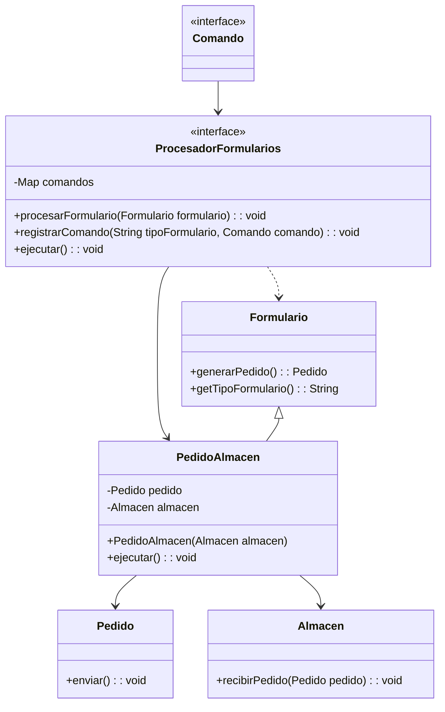
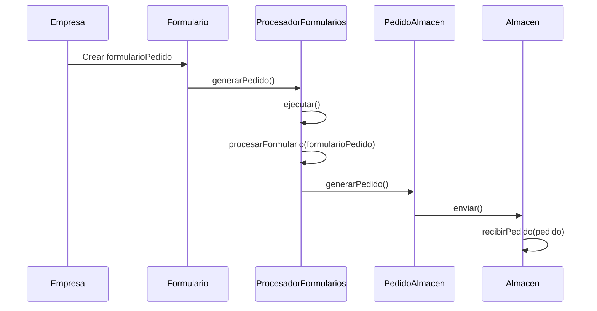
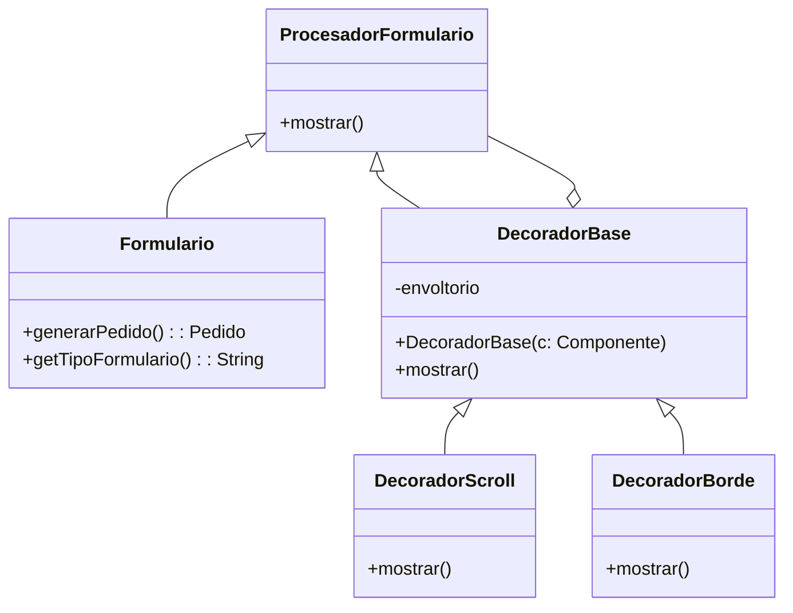

# Ejercicio Distribuidora
## Apartado a

```mermaid
classDiagram

    class Comando {
        <<interface>>
    }

    class Formulario {
        +generarPedido() : Pedido
        +getTipoFormulario() : String
    }

    class Pedido {
        +enviar() : void
    }


    class ProcesadorFormularios {
        <<interface>>
        -Map<String, Comando> comandos
        +procesarFormulario(Formulario formulario) : void
        +registrarComando(String tipoFormulario, Comando comando) : void
        +ejecutar() : void
    }

    class PedidoAlmacen {
        -Pedido pedido
        -Almacen almacen
        +PedidoAlmacen(Almacen almacen)
        +ejecutar() : void
    }

    class Almacen {
        +recibirPedido(Pedido pedido) : void
    }
    Comando --> ProcesadorFormularios  
    ProcesadorFormularios --> PedidoAlmacen
    PedidoAlmacen --> Pedido
    Formulario <|-- PedidoAlmacen
    PedidoAlmacen --> Almacen
    ProcesadorFormularios ..> Formulario
```

## Apartado b

```mermaid
sequenceDiagram
    participant Empresa
    participant Formulario
    participant ProcesadorFormularios
    participant PedidoAlmacen
    participant Almacen

    Empresa ->> Formulario: Crear formularioPedido
    Formulario ->> ProcesadorFormularios: generarPedido()
    ProcesadorFormularios ->> ProcesadorFormularios: ejecutar()

    ProcesadorFormularios ->> ProcesadorFormularios: procesarFormulario(formularioPedido)
    ProcesadorFormularios ->> PedidoAlmacen: generarPedido()
    PedidoAlmacen ->> Almacen: enviar()
    Almacen ->> Almacen: recibirPedido(pedido)

```

## Apartado c

```mermaid
classDiagram
class ProcesadorFormulario{
    +mostrar()
}
class Formulario {
        +generarPedido() : Pedido
        +getTipoFormulario() : String
    }
class DecoradorBase{
    -envoltorio
    +DecoradorBase(c: Componente)
    +mostrar()
}
class DecoradorScroll{
    +mostrar()
}
class DecoradorBorde{
    +mostrar()
    
}


ProcesadorFormulario <|-- Formulario
ProcesadorFormulario <|-- DecoradorBase
DecoradorBase <|-- DecoradorScroll
DecoradorBase <|-- DecoradorBorde

DecoradorBase o-- ProcesadorFormulario

```